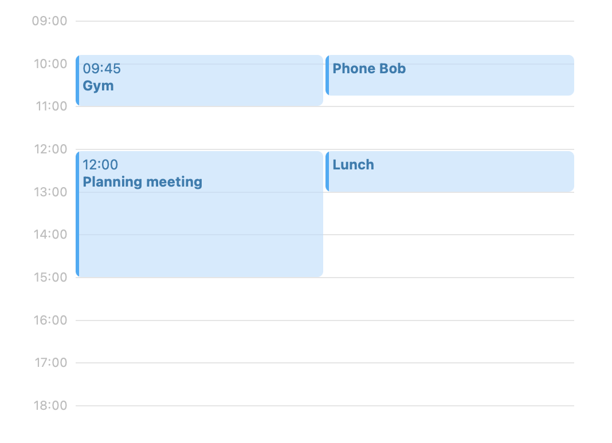
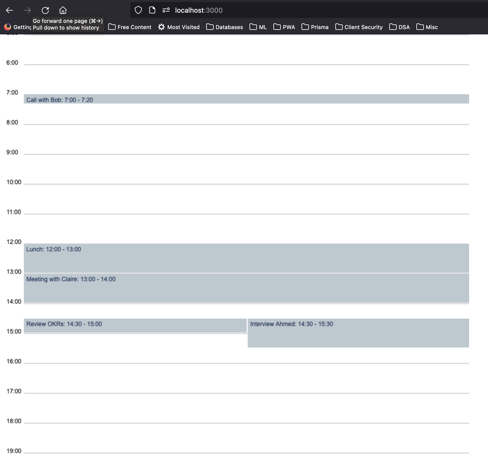

# Pace gets organised 📅

Thank you for taking the time to interview with Pace! We have a coding exercise we would like you to do to show us your skills, and give us something to talk about in our technical interview.

## Expectations

The exercise was designed to be solvable in an afternoon, yet a robust and comprehensive solution could take much longer. Rather than building a complete solution, please constrain yourself to around **three hours**, and use a shortup writeup to mention anything not achieved or any known limitations.

## Requirements

We would like to build a simple day view for a calendar, populated with data from a graphql API. The API returns a list of events which have a start and end time in minutes since midnight. So 9am is 540 minutes, 9.30 is 570 minutes and so on.

When rendering the calendar:

- Events should be shown without any overlapping
- If multiple events collide, then they should have equal width
- Styling can be kept extremely simple
- We only need to display the events

Your submission should also be reflective of how you would write production quality code, but don't fret if you run out of time - we aren't expecting polished solutions.

## Writeup

Written communication and thoughtful self-reflection is an important part of our work. This is an opportunity for you to tell us a bit more about the work you did. The writeup shouldn’t be long, but we will use it as part of the evaluation and discuss it in subsequent interview, so you should spend a bit of time and focus on it.

Here are some example questions your writeup could address:

- **What choices did you make and why?** HTML canvas because user input did not seem to be required, it was easy to draw to scale the hourly time scale through 24 hours corresponding to how the start and end times are provided in each events object.
- **What challenges did you face?** It took me a bit of time to map out a logical flow of drawings on HTML canvas - drawing the 24 hours of the daily view and then superimposing on it the individual calendar events represented by rectangles with text in them. This left little time for writing tests.
- **What tradeoffs did you choose?** Going with HTML canvas as the approach to solve this problem statement, also means that there is no simple way of adding an event handler to an item drawn on the canvas, as it is just a drawing - no interaction is possible. no tests given time
- **What do you like and not like about your solution?** I like that HTML canvas provides an easy way to visualise the calendar. However, if features were needed that require capturing user input or listening to events for individual calendar events, for example, this solution is not easily extensible.
- **What areas would you work on next?** I woud explore recreating this solution using flex box, with each calendar event represented by a box that can be highlighted and attached to click events individually. This would better accommodate interactivity.

It may be that this solution is adequate for it's use case if one would never require that additional features requiring interactivity be added. In a real-world use case, such as google calendar, interactivity would be important for the users, so this solution would be inoptimal for that use case.

## Technologies

A [next.js](https://nextjs.org/) boilerplate is used here to get started, including sample data. The sample data, though hard coded, is delivered to the client with a fetch request to a GraphQL interface.

In this solution, there are no additional libraries to create calendar components. This is because in this solution HTML Canvas is used to draw to scale the Calendar Day view. The decision to choose this is that it is believed that the required solution required no input from the user, but only a display of the calendar meets for the day. The user would not require to move drawn canvas items or edit them.

The result is shown below

- Testing setup has been done to use **[jest](https://jestjs.io/docs/getting-started)**. A sample test is provided in the `./tests/` directory. Tests can be run using the `npm test` command.

## Deliverables

Delivered in this repository are:

1. Source code of a web app that fulfils, as far as possible, the above requirements and uses the specified technologies, delivered in form of this private Git repository on GitHub.
2. This README that represents a short writeup of work delivered.

It has been a fun challenge!
